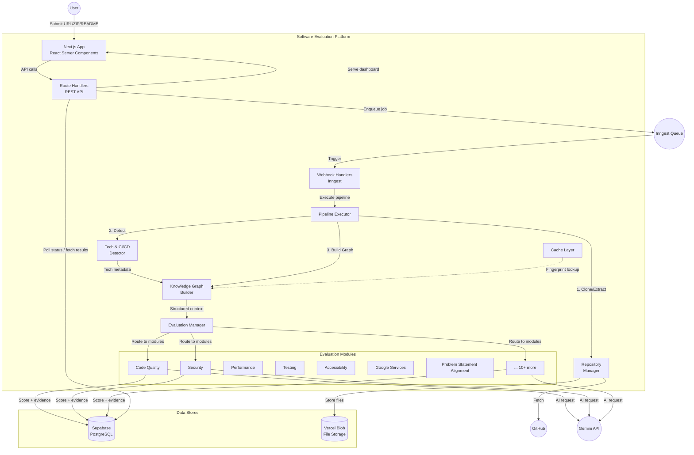
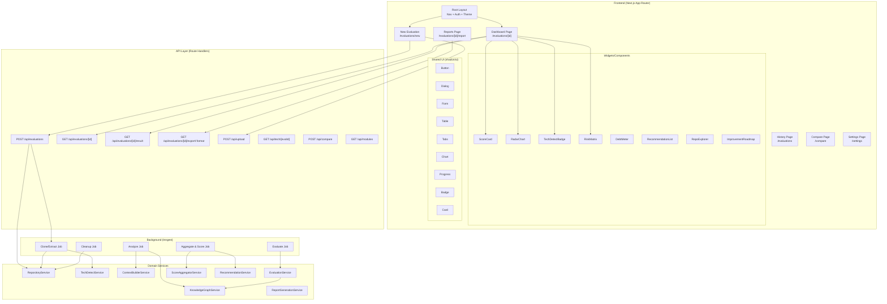
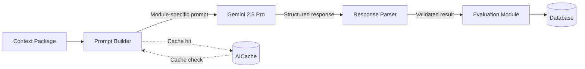
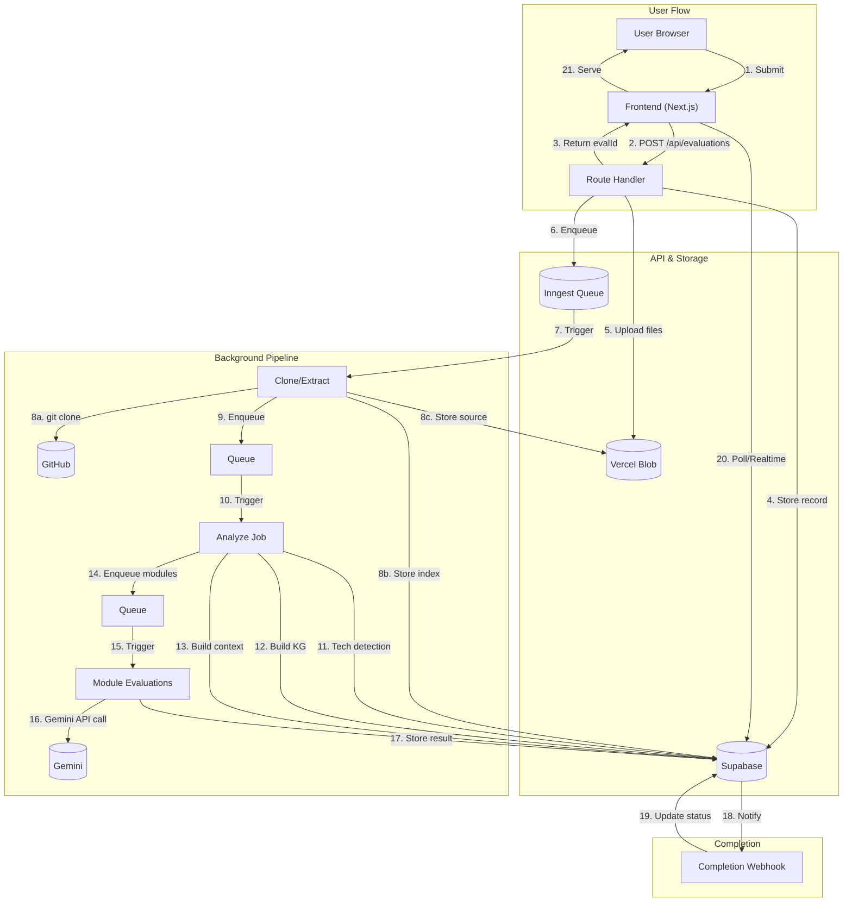
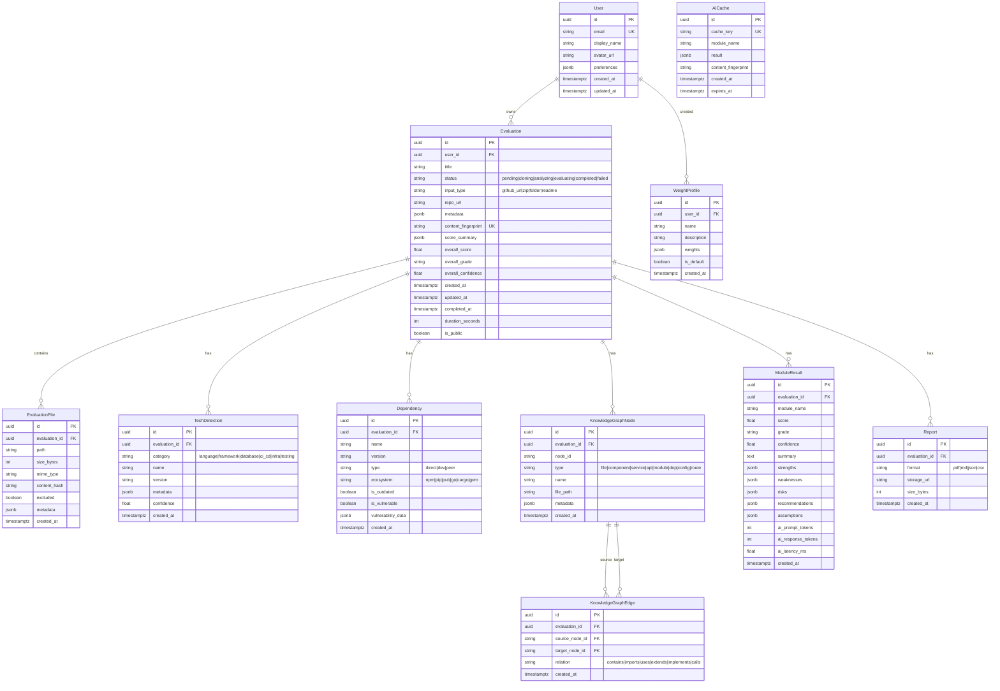

# Prompt 0 — Master Product Specification & Architecture

## AI-Powered Software Evaluation & Intelligence Platform

> **Status:** Blueprint / Pre-Implementation  
> **Version:** 1.0.0  
> **Target Stack:** Next.js 14+ (App Router) · React 18+ · TypeScript 5+ · Tailwind CSS 3+ · shadcn/ui · Supabase (PostgreSQL) · Gemini 2.5 Pro · Inngest · Vercel  

---

## Table of Contents

1. [Product Requirements Document (PRD)](#1-prd)
2. [User Personas](#2-user-personas)
3. [User Stories](#3-user-stories)
4. [Functional Requirements](#4-functional-requirements)
5. [Non-functional Requirements](#5-non-functional-requirements)
6. [System Architecture](#6-system-architecture)
7. [High-level Component Diagram](#7-component-diagram)
8. [Repository Analysis Pipeline](#8-repository-analysis-pipeline)
9. [AI Analysis Pipeline](#9-ai-analysis-pipeline)
10. [Data Flow Diagram](#10-data-flow-diagram)
11. [Database Entity Relationship Diagram](#11-erd)
12. [API Inventory](#12-api-inventory)
13. [Folder Structure](#13-folder-structure)
14. [Module Boundaries](#14-module-boundaries)
15. [State Management Strategy](#15-state-management)
16. [Error Handling Strategy](#16-error-handling)
17. [Logging Strategy](#17-logging)
18. [Monitoring Strategy](#18-monitoring)
19. [Security Architecture](#19-security)
20. [Performance Strategy](#20-performance)
21. [Accessibility Strategy](#21-accessibility)
22. [Testing Strategy](#22-testing)
23. [Deployment Strategy](#23-deployment)
24. [CI/CD Strategy](#24-cicd)
25. [Risk Register](#25-risk-register)
26. [Technical Assumptions](#26-technical-assumptions)
27. [Future Roadmap](#27-future-roadmap)

---

## 1. Product Requirements Document (PRD)

### 1.1 Product Vision

An AI-powered **Software Evaluation & Intelligence Platform** that performs deep semantic analysis of software projects — simulating a review conducted by experienced software architects, Google Solution Challenge judges, senior engineers, QA specialists, security engineers, and accessibility experts. The platform produces explainable scores, actionable recommendations, and comprehensive reports.

### 1.2 Problem Statement

Developers lack access to high-quality, structured, and explainable code reviews. Existing tools (linters, static analyzers, CI checks) produce superficial reports that miss architectural concerns, business-logic alignment, and holistic engineering quality. Manual reviews by senior engineers are expensive and inconsistent. An AI-driven platform that understands a repository holistically — architecture, business logic, security, performance, accessibility, and problem-statement alignment — democratizes access to expert-level code evaluation.

### 1.3 Target Audience

- Google Solution Challenge participants (primary)
- Hackathon participants (general)
- Students learning software engineering
- Software engineers seeking improvement
- Engineering managers evaluating team output
- Recruiters assessing candidate projects
- Open-source maintainers reviewing contributions
- Technical interviewers standardizing evaluations
- Startup founders validating codebases
- Mentors and judges in hackathons

### 1.4 Core Value Propositions

1. **Holistic Understanding** — Deep comprehension of architecture, logic, and intent, not lint
2. **Explainable Scoring** — Every score backed by evidence, not black-box AI
3. **Problem Statement Alignment** — Measures what was asked against what was built
4. **Actionable Recommendations** — Specific, file-grounded fixes with effort estimates
5. **Modular Evaluation** — Pick and choose evaluation dimensions
6. **Exportable Intelligence** — PDF, JSON, Markdown, CSV reports

### 1.5 Key Differentiators

| Differentiator | Current Tools | This Platform |
|---|---|---|
| Depth of analysis | Syntax/lint level | Semantic + architectural |
| Problem-statement awareness | None | Core capability |
| Modular scoring | Rigid | Fully configurable |
| Evidence transparency | Opaque | Every score cites files |
| AI architecture | Generic LLM | Gemini-optimized pipeline |
| Integration surface | GitHub only | GitHub + ZIP + folder + README |

---

## 2. User Personas

### 2.1 Priya — The Hackathon Participant
- **Age:** 21 | **Role:** CS undergraduate
- **Goal:** Submit a winning project to Google Solution Challenge
- **Pain Points:** Unsure if her project meets judging criteria; no access to senior reviewers
- **Needs:** Problem-statement alignment check, judging-criteria scoring, hackathon-readiness indicator
- **Technical Level:** Intermediate (React, Firebase, Node.js)

### 2.2 Marcus — The Open-Source Maintainer
- **Age:** 34 | **Role:** Senior Engineer / OSS project lead
- **Goal:** Evaluate pull requests and contributions consistently
- **Pain Points:** Manual reviews don't scale; inconsistent feedback
- **Needs:** Automated PR evaluation, security scanning, dependency health checks
- **Technical Level:** Expert

### 2.3 Dr. Aris — The Hackathon Judge
- **Age:** 45 | **Role:** Professor / Competition Judge
- **Goal:** Evaluate 50+ submissions fairly and quickly
- **Pain Points:** Impossible to deeply review every project manually
- **Needs:** Batch evaluation, consistent scoring, evidence-backed grades, exportable reports
- **Technical Level:** Moderate

### 2.4 Elena — The Engineering Manager
- **Age:** 38 | **Role:** Engineering Manager at startup
- **Goal:** Assess team code quality and track improvement over time
- **Pain Points:** Subjective performance reviews; can't measure quality trends
- **Needs:** Team dashboards, trend analysis, technical debt tracking, production readiness metrics
- **Technical Level:** High

### 2.5 Jordan — The Recruiter
- **Age:** 29 | **Role:** Technical Recruiter
- **Goal:** Objectively assess candidate code submissions
- **Pain Points:** Can't evaluate every submission personally
- **Needs:** Candidate scorecards, comparative rankings, skill gap analysis
- **Technical Level:** Low

### 2.6 Maya — The Startup Founder
- **Age:** 27 | **Role:** CTO / Solo Founder
- **Goal:** Validate her codebase before investor demo
- **Pain Points:** No budget for senior engineers; worried about blind spots
- **Needs:** Pre-demo audit, security review, production readiness check
- **Technical Level:** Intermediate

---

## 3. User Stories

| ID | User Story | Priority | Persona |
|---|---|---|---|
| US-01 | Submit a public GitHub repo URL for analysis | P0 | Priya, Marcus |
| US-02 | Upload a ZIP archive of my project | P0 | Priya, Maya |
| US-03 | Upload a project folder directly | P1 | Priya, Maya |
| US-04 | Upload a README separately | P1 | All |
| US-05 | Upload a problem statement for alignment check | P0 | Priya, Dr. Aris |
| US-06 | Upload custom evaluation criteria | P1 | Dr. Aris, Elena |
| US-07 | System detects my tech stack automatically | P0 | All |
| US-08 | Select which evaluation modules to run | P0 | All |
| US-09 | See numeric score and letter grade per module | P0 | All |
| US-10 | Every score backed by evidence with file references | P0 | All |
| US-11 | Check alignment with my problem statement | P0 | Priya, Dr. Aris |
| US-12 | Custom weighted scoring | P1 | Dr. Aris, Elena |
| US-13 | Confidence levels on every score | P0 | Dr. Aris |
| US-14 | Interactive dashboard with radar chart | P0 | All |
| US-15 | Repository explorer for analyzed files | P1 | Marcus, Elena |
| US-16 | Risk matrix showing issue severity | P0 | Maya, Elena |
| US-17 | Technical debt meter | P1 | Marcus, Elena |
| US-18 | Production readiness indicator | P1 | Maya, Elena |
| US-19 | Hackathon readiness indicator | P0 | Priya |
| US-20 | Actionable recommendations with estimated effort | P0 | All |
| US-21 | Export report as PDF | P0 | Dr. Aris, Elena |
| US-22 | Export report as Markdown | P1 | Marcus |
| US-23 | Export raw scores as JSON | P1 | Elena, Dr. Aris |
| US-24 | Export CSV summary | P2 | Elena |
| US-25 | Past evaluations saved in account | P1 | All |
| US-26 | Compare two evaluations side by side | P2 | Elena, Marcus |
| US-27 | Re-evaluate a project after fixes | P1 | Priya, Maya |

---

## 4. Functional Requirements

### 4.1 Input Processing
| ID | Requirement |
|---|---|
| FR-01 | Accept public GitHub repo URL, validate reachability, shallow clone |
| FR-02 | Accept ZIP upload (max 50 MB), CRC-validate, extract to sandbox |
| FR-03 | Accept README upload (Markdown, max 1 MB) |
| FR-04 | Accept problem statement upload (Markdown/PDF, max 5 MB) |
| FR-05 | Accept custom evaluation criteria as JSON or structured form |
| FR-06 | Validate URLs before cloning (reachability, .git presence) |
| FR-07 | Scan uploaded files for malware before extraction |
| FR-08 | Enforce size limits with clear user-facing messages |

### 4.2 Repository Analysis
| ID | Requirement |
|---|---|
| FR-09 | Detect programming languages and frameworks |
| FR-10 | Parse folder structure into directory tree |
| FR-11 | Identify components, modules, services, APIs, routes |
| FR-12 | Detect state management approach |
| FR-13 | Detect authentication mechanisms |
| FR-14 | Detect database schemas and ORM usage |
| FR-15 | Parse dependency files (package.json, requirements.txt, etc.) |
| FR-16 | Detect CI/CD configuration files |
| FR-17 | Detect infrastructure-as-code files |
| FR-18 | Detect design patterns used |
| FR-19 | Build a repository knowledge graph linking entities to files |

### 4.3 AI-Powered Analysis
| ID | Requirement |
|---|---|
| FR-20 | Use Gemini 2.5 Pro as primary AI reasoning engine |
| FR-21 | Build a comprehensive structured context package before AI calls |
| FR-22 | Never send raw repository files individually — use structured context |
| FR-23 | Use chain-of-thought prompting for deep reasoning |
| FR-24 | Clearly label all AI-inferred assumptions |
| FR-25 | Cache AI results keyed by repository fingerprint |
| FR-26 | Retry failed AI calls with exponential backoff (max 3) |
| FR-27 | Handle partial failures gracefully — score what's analyzable |

### 4.4 Evaluation Modules
| ID | Requirement |
|---|---|
| FR-28 | Each evaluation dimension is an independent module |
| FR-29 | Users can select which modules to run |
| FR-30 | Modules execute in parallel where possible |
| FR-31 | New modules added without modifying existing code (plugin pattern) |
| FR-32 | Standardized input/output contract for all modules |
| FR-33 | Problem Statement Alignment as top-tier module |
| FR-34 | Google Services evaluation (appropriateness, not quantity) |
| FR-35 | Code Quality evaluation |
| FR-36 | Security evaluation |
| FR-37 | Performance & Efficiency evaluation |
| FR-38 | Testing quality and coverage evaluation |
| FR-39 | Accessibility evaluation |

### 4.5 Scoring
| ID | Requirement |
|---|---|
| FR-40 | Numeric score 0-100 per module |
| FR-41 | Letter grade A+ through F per module |
| FR-42 | Confidence level 0.0-1.0 per module |
| FR-43 | Evidence with file paths and line numbers |
| FR-44 | Configurable overall score via weighted criteria |
| FR-45 | Preset scoring profiles ("Hackathon", "Enterprise") |

### 4.6 Recommendations
| ID | Requirement |
|---|---|
| FR-46 | Severity label (critical, high, medium, low, info) |
| FR-47 | Confidence level per recommendation |
| FR-48 | References to affected files |
| FR-49 | Explanation and suggested fix |
| FR-50 | Estimated implementation effort (minutes/hours/days) |
| FR-51 | Expected score improvement after fix |

### 4.7 Dashboard
| ID | Requirement |
|---|---|
| FR-52 | Overall score and grade |
| FR-53 | Radar chart of module scores |
| FR-54 | Individual score cards with drill-down |
| FR-55 | Technology detection summary |
| FR-56 | Dependency overview |
| FR-57 | Risk matrix |
| FR-58 | Technical debt meter |
| FR-59 | Production readiness and hackathon readiness indicators |
| FR-60 | Improvement roadmap |

### 4.8 Export
| ID | Requirement |
|---|---|
| FR-61 | PDF export with full formatting |
| FR-62 | Markdown export |
| FR-63 | JSON raw data export |
| FR-64 | CSV summary export |

---

## 5. Non-functional Requirements

| ID | Requirement | Target |
|---|---|---|
| NFR-01 | Repository cloning for repos < 100 MB | < 60s |
| NFR-02 | Initial analysis (tech detection, structure) | < 30s |
| NFR-03 | AI analysis progress updates | Every 10s |
| NFR-04 | Dashboard page load (TTFB + render) | < 2s |
| NFR-05 | Report export | < 30s |
| NFR-06 | Concurrent evaluations | 50 simultaneous |
| NFR-07 | Horizontal scaling via serverless | Auto-scale |
| NFR-08 | Database queries P95 | < 100ms |
| NFR-09 | Repository cache capacity | 10,000 analyses |
| NFR-10 | Background job queue | 1,000+ |
| NFR-11 | All communication | TLS 1.3 |
| NFR-12 | Uploads scanned for malware | Before extraction |
| NFR-13 | GitHub tokens encrypted at rest | AES-256-GCM |
| NFR-14 | Repository clones sandboxed | Per-evaluation isolation |
| NFR-15 | API rate limiting | 100/min unauthenticated, 1000/min authenticated |
| NFR-16 | No execution of user-uploaded code | Zero-trust |
| NFR-17 | AI API keys in environment variables | Never in code |
| NFR-18 | Uptime target | 99.9% |
| NFR-19 | Graceful degradation if AI APIs unavailable | Show cached/scores if available |
| NFR-20 | Browser support | Latest 2 versions Chrome, Firefox, Safari, Edge |
| NFR-21 | Responsive design | Mobile, tablet, desktop |
| NFR-22 | Accessibility standard | WCAG 2.2 AA |
| NFR-23 | Evaluation retention (free tier) | 90 days |
| NFR-24 | Repository clone cleanup | < 24h |
| NFR-25 | GDPR-compliant data deletion | User-initiated |

---

## 6. System Architecture

### 6.1 Architectural Style

**Hybrid Event-Driven + Layered Architecture** on a serverless foundation.

- **Presentation Layer:** Next.js App Router (React Server Components + Client Components)
- **API Layer:** Next.js Route Handlers (RESTful)
- **Application Layer:** Inngest serverless functions for background job orchestration
- **Domain Layer:** Modular evaluation engines (self-contained plugin units)
- **Infrastructure Layer:** Supabase (PostgreSQL), Gemini API, Vercel Blob Storage

### 6.2 Architecture Principles

1. **Separation of Concerns** — Each layer has a distinct responsibility
2. **Dependency Inversion** — Domain modules depend on abstractions, not concrete services
3. **Event-Driven Background Processing** — Long-running evaluations never block HTTP responses
4. **Immutable Analysis Artifacts** — Stored analysis results are append-only
5. **Caching by Fingerprint** — Repository content hash determines cache key
6. **Fail Isolated** — One module failing does not affect others
7. **Observability by Default** — Every job emits structured logs and metrics

### 6.3 Technology Justification

| Component | Choice | Why | Alternatives |
|---|---|---|---|
| Framework | Next.js 14+ (App Router) | SSR/SSG/RSC, serverless-ready, Vercel-native | Remix, SvelteKit |
| Language | TypeScript 5+ | Type safety across full stack | — |
| UI | Tailwind CSS + shadcn/ui | Rapid prototyping, accessible, consistent design system | Chakra UI, Radix Themes |
| Database | Supabase (PostgreSQL) | Managed Postgres, RLS, Realtime, generous free tier | Neon, PlanetScale |
| AI | Gemini 2.5 Pro | 1M token context window (best-in-class), low cost | Claude 4.5+, GPT-4o |
| Background Jobs | Inngest | Serverless-native, TypeScript-first, built-in retries | Trigger.dev, BullMQ |
| File Storage | Vercel Blob | Edge-delivered, serverless-friendly | Supabase Storage, S3 |
| Hosting | Vercel | First-class Next.js support, edge functions | Railway, Fly.io |
| Auth | Supabase Auth | RLS integration, OAuth providers | Clerk, NextAuth v5 |

### 6.4 System Context Diagram



---

## 7. High-level Component Diagram



---

## 8. Repository Analysis Pipeline

### 8.1 Pipeline Stages

```
Input → Validate → Clone/Extract → Structure Scan → Tech Detection → 
Dependency Analysis → Knowledge Graph → Context Package → 
[Evaluation Modules in Parallel] → Aggregate → Score → Report
```

### 8.2 Stage Details

#### Stage 1: Input Validation
- Validate URL format and reachability (GitHub URL regex, HTTP HEAD check)
- Validate ZIP integrity (CRC check, malware scan)
- Validate file types and sizes
- Return immediate errors (no background job for validation failures)

#### Stage 2: Clone / Extract
- **GitHub URL:** `git clone --depth 1` (shallow clone)
- **ZIP upload:** Extract to sandbox directory
- **Folder upload:** Stream files to blob storage
- Generate **content fingerprint** (SHA-256 of directory tree hash + all file hashes)
- Check cache: if fingerprint exists, return cached results

#### Stage 3: Structure Scan
- Recursively enumerate files and directories
- Build tree structure (JSON) with sizes and extensions
- Filter: binary files, node_modules, build artifacts, .git

#### Stage 4: Tech Detection
- Read framework config files (package.json, requirements.txt, pubspec.yaml, go.mod, etc.)
- Detect CI/CD: .github/workflows, .gitlab-ci.yml, Jenkinsfile
- Detect infrastructure: Dockerfile, docker-compose.yml, terraform/
- Detect database: schema files, migration folders, ORM configs
- Detect state management: Redux, Zustand, Context, MobX imports
- Detect auth: middleware files, auth libraries, OAuth configs
- Detect testing frameworks: Jest, Vitest, PyTest, Playwright

#### Stage 5: Dependency Analysis
- Parse dependency files for direct, dev, and peer dependencies
- Cross-reference with vulnerability databases (npm audit, OSV)
- Flag outdated, deprecated, or vulnerable packages
- Compute dependency health score

#### Stage 6: Knowledge Graph Construction

```json
{
  "nodes": [
    { "id": "file:src/app.tsx", "type": "file", "name": "app.tsx", "path": "src/app.tsx" },
    { "id": "component:App", "type": "component", "name": "App", "file": "src/app.tsx" },
    { "id": "api:/api/users", "type": "api_route", "method": "GET", "file": "src/api/users.ts" },
    { "id": "service:AuthService", "type": "service", "name": "AuthService", "file": "src/services/auth.ts" }
  ],
  "edges": [
    { "source": "file:src/app.tsx", "target": "component:App", "relation": "contains" },
    { "source": "component:App", "target": "service:AuthService", "relation": "imports" }
  ]
}
```

#### Stage 7: Context Package Assembly

```json
{
  "projectMetadata": { "name", "techStack", "fileCount", "totalLines" },
  "directoryTree": { /* hierarchical tree */ },
  "entryPoints": [ "src/app.tsx" ],
  "configFiles": { "package.json": {}, "tsconfig.json": {} },
  "knowledgeGraph": {},
  "dependencies": [],
  "ciCdConfigs": [],
  "infrastructure": [],
  "coreFiles": {
    "src/app.tsx": "truncated(500) content"
  },
  "problemStatement": "uploaded text",
  "readmeContent": "extracted text",
  "evaluationCriteria": { "modules": ["code_quality", "security"] }
}
```

Core files are truncated to 500 lines. The context builder selects the most relevant files per module. This respects Gemini's 1M token window while keeping costs low.

#### Stage 8: Parallel Evaluation
- Each module receives the context package
- Modules execute in parallel (up to 5 concurrent Gemini calls)
- Each returns: `{ score, grade, confidence, evidence, strengths, weaknesses, risks, recommendations }`

#### Stage 9: Score Aggregation
- Weighted formula: `overall = Σ(module_score × module_weight) / Σ(module_weight)`
- Default or custom weight profile
- Confidence-weighted overall score
- Generate letter grade from numeric score

#### Stage 10: Report Generation
- Compile module results into unified report
- Generate dashboard data
- Pre-cache Markdown, generate PDF on demand

---

## 9. AI Analysis Pipeline

### 9.1 Pipeline Architecture



### 9.2 Prompt Engineering Strategy

Each module has a bespoke system prompt:

1. **Set role context** — "You are a senior security engineer reviewing a project..."
2. **Define scope** — "Focus on authentication, data validation, and dependency vulnerabilities."
3. **Provide context** — Relevant portion of the context package
4. **Define output schema** — "Respond with valid JSON matching this schema..."
5. **Request evidence** — "Cite specific file paths and line numbers."
6. **Label assumptions** — "If inferring, label as ASSUMED."
7. **Set tone** — "Be constructive, specific, and actionable."

### 9.3 Output Schema (All Modules)

```typescript
interface ModuleResult {
  moduleName: string;
  score: number;           // 0-100
  grade: string;           // A+, A, A-, B+, B, B-, C+, C, C-, D, F
  confidence: number;      // 0.0 - 1.0
  summary: string;
  strengths: Finding[];
  weaknesses: Finding[];
  risks: Risk[];
  recommendations: Recommendation[];
  assumptions: Assumption[];
}

interface Finding {
  title: string;
  description: string;
  severity: 'critical' | 'high' | 'medium' | 'low' | 'info';
  filePath?: string;
  lineNumber?: number;
  category: string;
}

interface Risk {
  title: string;
  description: string;
  likelihood: 'low' | 'medium' | 'high';
  impact: 'low' | 'medium' | 'high';
  mitigation: string;
}

interface Recommendation {
  title: string;
  description: string;
  severity: 'critical' | 'high' | 'medium' | 'low' | 'info';
  confidence: number;
  affectedFiles: string[];
  explanation: string;
  suggestedFix: string;
  estimatedEffort: 'minutes' | 'hours' | 'days';
  expectedScoreImprovement: number; // 0-20
}

interface Assumption {
  description: string;
  category: string;
  confidence: number;
}
```

### 9.4 Caching Strategy

- **Cache Key:** `sha256(repoFingerprint + moduleName + problemStatementFingerprint)`
- **Cache TTL:** 24 hours
- **Storage:** `ai_cache` table in Supabase
- **Invalidation:** On explicit re-evaluation
- **Expected savings:** 60-70% reduction in API costs

### 9.5 Fallback Strategy

| Failure Mode | Handling |
|---|---|
| Gemini timeout (10s+) | Retry: 1s, 3s, 9s exponential backoff |
| Non-JSON response | Re-prompt with stricter schema |
| Partial module failure | Score available modules, mark failed as "not evaluated" |
| All modules fail | Return error with troubleshooting |
| Rate limit (429) | Retry after `Retry-After` header |
| Context overflow | Reduce excerpts, structural analysis only |

### 9.6 Module-Specific Prompt Customization

| Module | Role | Scope Focus | Context Excerpts |
|---|---|---|---|
| Code Quality | Senior Engineer | Naming, formatting, duplication | Source files (sampled) |
| Security | Security Engineer | Auth, injection, secrets, XSS | Auth files, API routes, config |
| Performance | Performance Engineer | Bundle size, N+1 queries, caching | API routes, DB queries, components |
| Testing | QA Lead | Coverage, test design, fixtures | Test files, CI config |
| Accessibility | A11y Expert | ARIA, semantic HTML, contrast, keyboard | Component files, templates |
| Google Services | GCP Architect | Appropriate use, best practices | Firebase/GCP configs |
| Problem Alignment | Product Manager | Feature-to-requirement mapping | Problem statement + all source |

---

## 10. Data Flow Diagram



---

## 11. Database Entity Relationship Diagram

### 11.1 Schema



### 11.2 Indexing Strategy

| Table | Index | Type | Purpose |
|---|---|---|---|
| evaluation | user_id | B-tree | User's evaluations |
| evaluation | content_fingerprint | Hash | Cache lookup |
| evaluation | status + created_at | Composite B-tree | Queue ordering |
| module_result | evaluation_id + module_name | Composite Unique | Upsert |
| ai_cache | cache_key | Hash | Fast cache lookup |

### 11.3 Row-Level Security (RLS)

```sql
-- Users see only their own evaluations
CREATE POLICY eval_isolation ON evaluation
    FOR ALL USING (user_id = auth.uid());

-- Public evaluations (opt-in)
CREATE POLICY eval_public_read ON evaluation
    FOR SELECT USING (is_public = true OR user_id = auth.uid());
```

---

## 12. API Inventory

### 12.1 Route Handlers (all prefixed `/api/`)

| Method | Path | Auth | Purpose |
|---|---|---|---|
| POST | /evaluations | Optional | Create evaluation |
| GET | /evaluations | Required | List user's evaluations |
| GET | /evaluations/:id | Required* | Get evaluation details + status |
| GET | /evaluations/:id/result | Required* | Get full results |
| DELETE | /evaluations/:id | Required | Delete evaluation |
| POST | /evaluations/:id/reevaluate | Required | Re-request evaluation |
| POST | /upload | Optional | Upload ZIP/file/README |
| GET | /evaluations/:id/export/:format | Required* | Export (pdf/md/json/csv) |
| POST | /compare | Required | Compare two evaluations |
| GET | /modules | None | List available modules |
| GET | /modules/:name | None | Module details |
| GET | /tech/:evalId | Required* | Tech detection results |
| GET | /dependencies/:evalId | Required* | Dependency analysis |
| GET | /user/profile | Required | User profile |
| PATCH | /user/profile | Required | Update profile |
| GET | /user/preferences | Required | Get preferences |
| PATCH | /user/preferences | Required | Update preferences |
| GET | /weight-profiles | Required | List weight profiles |
| POST | /weight-profiles | Required | Create weight profile |
| POST | /api/inngest | Inngest signature | Inngest webhook |
| GET | /health | None | Health check |

> `*` = Required unless evaluation is public

### 12.2 Standard Response Format

```typescript
// Success
{ "success": true, "data": {}, "meta": { "requestId": "req_...", "timestamp": "..." } }

// Error
{ "success": false, "error": { "code": "...", "message": "..." }, "meta": {} }

// Pagination
{ "success": true, "data": [], "pagination": { "page": 1, "pageSize": 20, "total": 150, "hasMore": true }, "meta": {} }
```

### 12.3 Error Codes

| Code | HTTP | Meaning |
|---|---|---|
| INVALID_INPUT | 400 | Malformed request |
| VALIDATION_ERROR | 422 | Input validation failed |
| NOT_FOUND | 404 | Resource not found |
| UNAUTHORIZED | 401 | Authentication required |
| FORBIDDEN | 403 | Not authorized |
| RATE_LIMITED | 429 | Too many requests |
| EVALUATION_FAILED | 500 | Pipeline failed |
| AI_UNAVAILABLE | 503 | Gemini unavailable |
| INTERNAL_ERROR | 500 | Unexpected error |

---

## 13. Folder Structure

```
├── .github/workflows/
│   ├── ci.yml                    # Lint, type-check, test
│   └── preview.yml               # Vercel preview deployments
│
├── src/
│   ├── app/                      # Next.js App Router
│   │   ├── layout.tsx            # Root layout
│   │   ├── page.tsx              # Landing page
│   │   ├── loading.tsx           # Global loading
│   │   ├── error.tsx             # Global error boundary
│   │   ├── not-found.tsx         # 404
│   │   ├── (auth)/               # Auth-required layout group
│   │   │   ├── layout.tsx
│   │   │   ├── dashboard/page.tsx
│   │   │   ├── evaluations/
│   │   │   │   ├── new/page.tsx
│   │   │   │   └── [id]/
│   │   │   │       ├── page.tsx
│   │   │   │       ├── report/page.tsx
│   │   │   │       └── loading.tsx
│   │   │   ├── compare/page.tsx
│   │   │   └── settings/page.tsx
│   │   ├── api/                  # Route Handlers
│   │   │   ├── evaluations/
│   │   │   │   ├── route.ts
│   │   │   │   └── [id]/
│   │   │   │       ├── route.ts
│   │   │   │       ├── result/route.ts
│   │   │   │       ├── export/[format]/route.ts
│   │   │   │       └── reevaluate/route.ts
│   │   │   ├── upload/route.ts
│   │   │   ├── compare/route.ts
│   │   │   ├── modules/route.ts
│   │   │   ├── tech/[evalId]/route.ts
│   │   │   ├── dependencies/[evalId]/route.ts
│   │   │   ├── user/profile/route.ts
│   │   │   ├── weight-profiles/route.ts
│   │   │   ├── health/route.ts
│   │   │   └── inngest/route.ts
│   │   └── public/[shareId]/page.tsx
│   │
│   ├── components/
│   │   ├── ui/                   # shadcn/ui primitives
│   │   ├── layout/               # Nav, footer, sidebar, auth-guard
│   │   ├── evaluation/           # ScoreCard, RadarChart, TechDetect, RiskMatrix,
│   │   │                        # DebtMeter, ReadinessIndicator, RecommendationList,
│   │   │                        # RepoExplorer, ImprovementRoadmap, ModuleSelector,
│   │   │                        # ComparisonView, EvalHistoryTable
│   │   │                        # Plus skeleton variants for all
│   │   ├── report/               # ReportHeader, ReportSection, ExportActions
│   │   └── shared/               # LoadingSpinner, EmptyState, ErrorState,
│   │                            # FileUpload, UrlInput, MarkdownRenderer
│   │
│   ├── hooks/
│   │   ├── use-evaluation.ts
│   │   ├── use-evaluation-list.ts
│   │   ├── use-tech-detection.ts
│   │   ├── use-dependencies.ts
│   │   ├── use-user.ts
│   │   ├── use-export.ts
│   │   ├── use-polling.ts
│   │   └── use-realtime-status.ts
│   │
│   ├── lib/
│   │   ├── supabase/             # Client, server-client, admin-client, middleware
│   │   ├── gemini/               # Client, prompt-builder, schema, cache, fallback
│   │   ├── validators/           # URL, upload validation
│   │   ├── utils/                # Scoring, fingerprint, formatters, cn
│   │   └── constants.ts
│   │
│   ├── inngest/
│   │   ├── client.ts
│   │   └── functions/            # clone, analyze, evaluate, aggregate, cleanup
│   │
│   ├── services/                 # Repository, TechDetect, KnowledgeGraph,
│   │                            # ContextBuilder, Evaluation, ScoreAggregator,
│   │                            # Recommendation, Report, AICache
│   │
│   ├── modules/
│   │   ├── registry.ts           # Module registry
│   │   ├── base-module.ts        # Abstract base class
│   │   ├── code-quality/         # index.ts, prompt.ts, config.ts
│   │   ├── security/             # Same structure
│   │   ├── performance/          # ...
│   │   ├── testing/
│   │   ├── accessibility/
│   │   ├── google-services/
│   │   ├── problem-alignment/
│   │   ├── architecture/
│   │   ├── scalability/
│   │   ├── documentation/
│   │   ├── devops/
│   │   ├── api-design/
│   │   ├── maintainability/
│   │   └── ui-ux/
│   │
│   ├── types/                    # evaluation.ts, module.ts, gemini.ts, api.ts
│   └── config/                   # modules.ts, weights.ts, constants.ts
│
├── tests/
│   ├── unit/                     # Services, modules, lib
│   ├── integration/              # API, pipeline
│   ├── e2e/                      # Playwright specs
│   └── fixtures/                 # Sample repos, problem statements
│
├── .env.local.example
├── tailwind.config.ts
├── tsconfig.json
├── next.config.ts
├── components.json
└── package.json
```

---

## 14. Module Boundaries

### 14.1 Plugin Architecture

Each evaluation module implements a strict contract:

```typescript
abstract class EvaluationModule {
  abstract readonly id: string;
  abstract readonly name: string;
  abstract readonly description: string;
  abstract readonly version: string;
  abstract readonly defaultWeight: number;
  abstract readonly icon: string;
  abstract readonly dependencies: string[];
  abstract evaluate(context: ContextPackage): Promise<ModuleResult>;
  postProcess?(result: ModuleResult): Promise<ModuleResult>;
}
```

### 14.2 Module Registry

```typescript
const moduleRegistry = new Map<string, EvaluationModule>();

function registerModule(module: EvaluationModule): void { /* ... */ }
function getModule(id: string): EvaluationModule | undefined { /* ... */ }
function getAllModules(): EvaluationModule[] { /* ... */ }
```

### 14.3 Adding a New Module

1. Create folder `src/modules/<name>/`
2. Implement `EvaluationModule` abstract class
3. Create `prompt.ts` with Gemini prompt
4. Create `config.ts` with weights and rubric
5. Register in `src/config/modules.ts` with one line

**No other files change.** The pipeline, dashboard, and export iterate over the registry.

### 14.4 Module Dependencies

| Module | Depends On |
|---|---|
| api-design | architecture |
| maintainability | code-quality, architecture |
| google-services | tech-detection (pre-pipeline) |
| problem-alignment | All others |
| technical-debt | code-quality, architecture, maintainability |

Dependencies are resolved at evaluation time — the system runs `B` before `A`.

### 14.5 Module Isolation

- Each module runs in its own Inngest job invocation
- Modules share the context package (read-only)
- Results are independently stored in `module_result`
- Score aggregator reads all completed results

---

## 15. State Management Strategy

| State Type | Tool | Purpose |
|---|---|---|
| Server State | React Server Components | Initial data loading, SEO |
| Client State | React useState/useReducer | Forms, UI interactions |
| Async Server | TanStack Query | API fetching, caching, polling |
| Real-time | Supabase Realtime | Evaluation status updates |
| Global UI | React Context | Theme, user preferences |
| Forms | React Hook Form + Zod | Validation + submission |
| URL State | useSearchParams | Filters, pagination |

**Why TanStack Query:** Built-in caching, dedup, background refetch, optimistic updates, less boilerplate than Redux.

**Key State Shapes:**

```typescript
interface EvaluationFormState {
  inputType: 'github_url' | 'zip' | 'folder' | 'readme';
  repoUrl: string;
  title: string;
  problemStatement?: File | string;
  selectedModules: string[];
  weightProfile?: string;
}

interface EvaluationProgress {
  status: 'pending' | 'cloning' | 'analyzing' | 'evaluating' | 'completed' | 'failed';
  progress: number;
  currentModule?: string;
  completedModules: string[];
  failedModules: string[];
}

interface DashboardData {
  evaluation: Evaluation;
  overallScore: number;
  overallGrade: string;
  moduleResults: ModuleResult[];
  techStack: TechDetection[];
  recommendations: Recommendation[];
}
```

---

## 16. Error Handling Strategy

### 16.1 Frontend

| Layer | Technique |
|---|---|
| Route-level | error.tsx boundaries with retry |
| Global | Root error.tsx with "Go Home" |
| Data fetching | TanStack Query onError → toast + retry |
| Forms | React Hook Form inline errors |
| Uploads | Client-side validation before upload |
| AI failures | "Some modules couldn't be evaluated" |

### 16.2 Backend

| Layer | Technique |
|---|---|
| Route Handlers | try/catch → standardized error response |
| Inngest Jobs | Built-in 3-attempt retry |
| Gemini Calls | Exponential backoff + fallback |
| Clone/Extract | Timeout at 60s + cleanup |
| Validation | Zod schemas at API boundary |
| Unhandled | Global error boundary + capture |

### 16.3 Error Taxonomy

```typescript
class AppError extends Error {
  constructor(public code: string, message: string, 
              public statusCode: number = 500, public details?: Record<string, unknown>)
}

class ValidationError extends AppError {
  constructor(message: string, details?: Record<string, unknown>) {
    super('VALIDATION_ERROR', message, 422, details);
  }
}

class NotFoundError extends AppError {
  constructor(resource: string) { super('NOT_FOUND', `${resource} not found`, 404); }
}

function apiErrorHandler(error: unknown) {
  if (error instanceof AppError) { /* structured response */ }
  console.error('Unhandled error:', error);
  return { /* generic 500 response */ };
}
```

### 16.4 User Messages

| Scenario | Message |
|---|---|
| Invalid URL | "The URL doesn't appear to be a valid GitHub repository." |
| File too large | "The uploaded file exceeds the 50 MB limit." |
| Clone failed | "Could not clone the repository. It may be private or unreachable." |
| AI unavailable | "The AI engine is temporarily unavailable. Please try again." |
| Module failed | "The [Module] evaluation couldn't complete. Other results are unaffected." |

---

## 17. Logging Strategy

| Layer | Tool | Purpose |
|---|---|---|
| Server | Pino (JSON) | Structured request/response logging |
| Next.js API | Pino with nanoid request IDs | Correlation IDs |
| Inngest | Pino + Inngest built-in | Job lifecycle |
| Client | Pino browser logger | Frontend errors |
| AI calls | Structured logger | Tokens, latency, cost |

**Log Levels:** error, warn, info, debug (local dev only: trace)

**Key Events to Log:**
- Evaluation created (evalId, inputType, userId)
- Repository cloned (duration, fileCount, size)
- AI call started/completed (module, tokens, duration, cost)
- AI call failed (module, error, retryAttempt)
- Module scored (module, score, confidence)
- Evaluation completed (overallScore, duration)

---

## 18. Monitoring Strategy

### 18.1 Health Endpoint

`GET /api/health` → `{ status, services: { database, gemini, blob, inngest }, version }`

### 18.2 Metrics

| Metric | Source |
|---|---|
| Evaluation throughput | Database |
| Average eval duration | Database |
| Module failure rate | Database |
| AI API latency | Application |
| AI API cost per eval | Application |
| Cache hit rate | Database |
| Error rate (5xx) | Vercel |
| P95 API response time | Vercel |
| Daily active users | Supabase |

### 18.3 Alert Thresholds

| Condition | Severity |
|---|---|
| AI error rate > 5% over 5 min | Critical |
| Evaluation failure rate > 10% over 15 min | Critical |
| P95 API response > 5s | Warning |
| Cache hit rate < 20% over 1 hour | Warning |

### 18.4 Frontend Monitoring

- Vercel Analytics for Core Web Vitals
- Sentry for error tracking
- React Profiler for slow re-renders

---

## 19. Security Architecture

### 19.1 Threat Model

| Threat | Mitigation | Priority |
|---|---|---|
| Malicious upload (ZIP bomb) | Scan, sandbox, size limits | Critical |
| Code injection via file content | Treat all input as untrusted, sanitize display | Critical |
| API key exposure | Server-side only, env vars, restricted CORS | Critical |
| Unauthorized evaluation access | RLS, auth checks | High |
| SSRF via GitHub clone | Restrict sandbox network | High |
| Mass evaluation (DoS) | Rate limiting, concurrency caps | High |
| Supply chain | Pin versions, audit dependencies | Medium |

### 19.2 Security Controls

- **Auth:** Supabase Auth with email/password + OAuth (Google, GitHub), HTTP-only cookies
- **Authorization:** Row-Level Security on all user-owned tables
- **Input Validation:** Zod at API boundaries, file type/size checks
- **Sandboxing:** Isolated directories `/tmp/evaluations/{evalId}/`, no code execution
- **Rate Limiting:** Per-route-group limits
- **Secrets:** Vercel environment variables, never in client code
- **CORS:** Restricted to app origin

### 19.3 Data Privacy

| Data | Storage | Retention | Encryption |
|---|---|---|---|
| Source files | Blob | 24h | AES-256 |
| Analysis results | Supabase | 90 days | Column-level |
| Uploads | Blob | 24h | AES-256 |

---

## 20. Performance Strategy

### 20.1 Frontend

| Technique | Impact |
|---|---|
| React Server Components | -40% JS bundle |
| Streaming SSR + skeletons | Faster TTFB |
| Image optimization (WebP) | Smaller payloads |
| Code splitting per module | Smaller initial bundle |
| Static generation (landing) | Instant load |
| Dynamic imports (charts) | Lazy loading |
| Virtual scrolling (file tree) | Smooth rendering |

### 20.2 Backend

| Technique | Impact |
|---|---|
| Edge functions (auth, static) | < 50ms global |
| Parallel module execution | 5× faster |
| Connection pooling (pgBouncer) | Efficient DB |
| Indexed queries | < 100ms |
| CDN caching | < 10ms cache hits |

### 20.3 AI

| Technique | Impact |
|---|---|
| Context optimization (500-line truncation) | Lower cost, faster |
| Gemini Flash for tech detection | 5-10× faster detection |
| Parallel module AI calls | 5× faster |
| Response caching | 0ms for cache hits |

### 20.4 Targets

| Metric | Target |
|---|---|
| Dashboard TTI (first) | < 2s desktop, < 3s mobile |
| Dashboard TTI (subsequent) | < 1s |
| Eval completion (small repo) | < 2 min |
| Eval completion (large repo) | < 5 min |
| JSON/MD export | < 5s |
| PDF export | < 15s |
| Lighthouse Performance | > 90 |

---

## 21. Accessibility Strategy

**Target:** WCAG 2.2 Level AA

| Requirement | Implementation |
|---|---|
| Semantic HTML | nav, main, section, article |
| Color contrast | ≥ 4.5:1 text, ≥ 3:1 large text |
| Keyboard nav | All interactive elements operable |
| Focus indicators | Tailwind `focus-visible:ring-2` |
| Screen reader | aria-label, aria-describedby |
| Form labels | All inputs have `<label>` |
| Error identification | Linked text errors |
| Status messages | aria-live regions |
| Skip navigation | "Skip to content" link |
| Reduced motion | `prefers-reduced-motion` |
| Responsive zoom | Works at 200% |

**Component-Specific:**
- RadarChart: SVG with role="img", data table fallback
- RiskMatrix: `<table>` with color + icon + text (not color alone)
- ProgressTracker: aria-valuenow/min/max
- RepoExplorer: role="tree", aria-expanded

**Testing:** axe-core in CI, manual NVDA/VoiceOver for critical flows

---

## 22. Testing Strategy

### 22.1 Test Pyramid

```
         /\
        /E2E\           ← 5%: Critical user flows
       /------\
      /Integration\     ← 25%: APIs, pipeline stages, module contracts
     /--------------\
    /   Unit Tests    \ ← 70%: Services, utilities, components
   /--------------------\
```

### 22.2 Unit Testing (Vitest)
- Services: logic, data transformation, edge cases
- Utilities: scoring math, fingerprinting, validation
- Components: rendering, interactions, loading/error/empty states
- Hooks: behavior, state transitions

**Coverage:** 80% services/utils, 60% components

### 22.3 Integration Testing
- API Routes: request/response contracts, error codes, auth
- Pipeline: full pipeline with mocked services
- Database: CRUD, RLS, queries

### 22.4 E2E Testing (Playwright)
- Submit URL → View dashboard → Export report
- Auth flow
- Error states (invalid URL, upload failure)
- Accessibility scan with axe-core
- Responsive breakpoints

### 22.5 Testing Patterns

**Loading States:** Every data-driven component has a Skeleton variant

**Error States:** Test API error → error state with retry; partial module failure → banner

**Empty States:** Empty list → "No evaluations yet" with CTA; no recommendations → "Looks good!"

**Edge Cases:** 10,000+ file repos → truncated; empty repos → error; binary-only → appropriate message

### 22.6 Test Fixtures
- `tests/fixtures/sample-repos/` — react-next-app, express-api, empty-repo, binary-only
- `tests/fixtures/sample-problem-statements/` — Example problem statements

---

## 23. Deployment Strategy

### 23.1 Architecture

```
Vercel Edge Network (CDN)
  └─ Serverless Functions (Node 20)
       └─ Inngest (hosted background jobs)
Supabase (PostgreSQL 16 + Auth + RLS + Realtime)
Vercel Blob Storage
Google AI (Gemini 2.5 Pro)
```

### 23.2 Environments

| Environment | URL | Deploy Trigger |
|---|---|---|
| Production | app.codeeval.ai | Merge to main |
| Staging | staging.codeeval.ai | Merge to staging |
| Preview | pr-*.vercel.app | PR opened |
| Local | localhost:3000 | Manual |

### 23.3 Environment Variables

```
NEXT_PUBLIC_SUPABASE_URL=
NEXT_PUBLIC_SUPABASE_ANON_KEY=
SUPABASE_SERVICE_ROLE_KEY=
GEMINI_API_KEY=
INNGEST_EVENT_KEY=
INNGEST_SIGNING_KEY=
NEXT_PUBLIC_APP_URL=
```

### 23.4 Vercel Configuration

```json
{
  "functions": {
    "src/app/api/**/*.ts": { "maxDuration": 60 }
  },
  "crons": [
    { "path": "/api/cron/cleanup", "schedule": "0 6 * * *" }
  ]
}
```

---

## 24. CI/CD Strategy

### 24.1 CI Pipeline (`.github/workflows/ci.yml`)

On every PR:
1. **Lint** — ESLint + Next.js lint
2. **Type-check** — `tsc --noEmit`
3. **Test** — Vitest with coverage → Codecov
4. **A11y** — axe-core scans
5. **Build** — `next build` (verification)

### 24.2 CD Pipeline

- **main** → Auto-deploy to production
- **staging** → Auto-deploy to staging
- **PR branches** → Auto-preview deployment (Vercel)
- **Rollback** — Vercel instant rollback

### 24.3 Pre-merge Checklist

- [ ] All CI checks pass
- [ ] No new critical/high dependency vulnerabilities
- [ ] PR reviewed and approved
- [ ] E2E tests pass
- [ ] A11y scan passes
- [ ] Backward compatible

---

## 25. Risk Register

| ID | Risk | Likelihood | Impact | Mitigation |
|---|---|---|---|---|
| R-01 | Gemini API downtime | Med | Critical | Cache + retry + graceful degradation |
| R-02 | AI cost overrun | Med | High | Aggressive caching, context optimization, per-user quotas |
| R-03 | Large repo exceeds context window | Med | High | Smart file selection, truncation, structural-only fallback |
| R-04 | Malicious upload (ZIP bomb) | Low | Critical | Malware scan, size limits, sandbox |
| R-05 | GDPR/privacy violation | Med | High | Auto-delete 24h, encryption, user deletion option |
| R-06 | AI hallucination | Med | Medium | Evidence requirements, confidence scores, assumption labeling |
| R-07 | Database bottleneck | Low | Medium | Connection pooling, indexing, read replicas |
| R-08 | Vercel cold starts | Med | Low | Keep-alive, ISR for static pages |
| R-09 | Dependency vulnerability | Med | High | `npm audit`, Dependabot, lockfile pinning |
| R-10 | GitHub API rate limiting | Med | Low | `--depth 1` clone, token auth |

---

## 26. Technical Assumptions

### 26.1 Explicit Assumptions

1. **GitHub is the primary input.** GitLab/Bitbucket are future additions.
2. **Gemini 2.5 Pro is the sole AI engine.** No fallback to other LLMs.
3. **Serverless execution is acceptable.** Clone/analysis fits within Vercel's 300s limit.
4. **Source files are never executed.** Read-only text analysis. Binary files skipped.
5. **Users own the code they upload.** No reuse or training. 24h retention.
6. **Problem statement is optional.** Without one, alignment module is skipped.
7. **Free tier is single-analysis only.** Re-evaluation and comparison are premium.
8. **Supabase free tier is sufficient for early stage.** Beyond 500 MB DB / 50K MAU, upgrade.
9. **Inngest free tier covers initial launch.** 1,000 monthly runs. Beyond that, Teams plan.
10. **Users consent to AI analysis.** ToS includes Gemini API usage clause.

### 26.2 Design Decisions & Trade-offs

| Decision | Rationale | Trade-off |
|---|---|---|
| Single AI provider (Gemini) | Best context window, Google alignment | Vendor lock-in |
| Serverless background jobs | No server management, scales to zero | 300s timeout |
| Supabase over Neon/PlanetScale | Auth + DB + Storage in one service | Less mature some features |
| React Query over Redux | Simpler, server-state focused | Less client orchestration |
| shadcn/ui over custom UI | Rapid dev, accessible, customizable | Dependency on packages |
| No execution sandbox | Security, complexity | No dynamic analysis |

---

## 27. Future Roadmap

### Phase 1: Foundation (Weeks 1-3)
- [ ] Next.js + Tailwind + shadcn/ui project setup
- [ ] Supabase project (DB schema, auth, RLS)
- [ ] Inngest integration
- [ ] GitHub URL input + validation + shallow clone
- [ ] Tech detection
- [ ] Knowledge graph construction
- [ ] Code Quality + Security modules
- [ ] Basic score aggregation
- [ ] Minimal dashboard (overall score, radar chart skeleton)
- [ ] JSON export
- [ ] Vercel deployment

**Deliverable:** User submits GitHub URL → sees basic evaluation with 2 modules → exports JSON.

### Phase 2: Evaluation Depth (Weeks 4-6)
- [ ] ZIP upload support
- [ ] Problem Statement upload
- [ ] Problem Statement Alignment module
- [ ] Google Services module
- [ ] Performance module
- [ ] Testing module
- [ ] Accessibility module
- [ ] Recommendation system with effort estimates
- [ ] Full dashboard (score cards, risk matrix)
- [ ] PDF export

**Deliverable:** Complete evaluation with 6+ modules, full dashboard, PDF export.

### Phase 3: Polish & Scale (Weeks 7-9)
- [ ] README upload
- [ ] Folder upload
- [ ] AI response caching
- [ ] Evaluation history
- [ ] User auth & profiles
- [ ] Weight profiles
- [ ] Module selector
- [ ] Comparison view
- [ ] Re-evaluation support
- [ ] Markdown + CSV export
- [ ] Loading/error/empty states everywhere
- [ ] Accessibility audit
- [ ] All remaining modules

**Deliverable:** Full-featured platform with caching, history, comparison, all modules.

### Phase 4: Advanced Features (Weeks 10-12)
- [ ] Public evaluation sharing (opt-in)
- [ ] Team/shared evaluations
- [ ] Batch evaluation (for judges)
- [ ] AI prompt refinement from real usage
- [ ] Gemini Flash for faster detection
- [ ] Real-time progress (Supabase Realtime)
- [ ] Comprehensive test suite
- [ ] Performance optimization
- [ ] Security audit
- [ ] SEO for public pages

### Phase 5: Ecosystem (Weeks 13+)
- [ ] GitLab integration
- [ ] Bitbucket integration
- [ ] Azure DevOps integration
- [ ] GitHub App (PR analysis)
- [ ] VS Code extension
- [ ] CLI tool
- [ ] API for third-party integrations
- [ ] Custom module SDK
- [ ] Team workspaces
- [ ] Enterprise SSO/SAML

---

## 28. Quality Gates Checklist

### [✅] Completeness
- All 27+ deliverables defined
- Every input type supported
- All evaluation modules specified
- All export formats defined
- All dashboard components listed

### [✅] Scalability
- Horizontal scaling via serverless
- Parallel module execution
- Multi-level caching (AI, DB, CDN)
- Background job queue
- Indexed database queries

### [✅] Security
- RLS policies for data isolation
- No execution of user code
- Input validation at all boundaries
- Rate limiting
- Malware scanning
- Encrypted secrets

### [✅] Maintainability
- Modular plugin architecture
- Clear separation of concerns
- Standardized module contract
- TypeScript throughout

### [✅] Extensibility
- Plugin registration pattern (add module → it works everywhere)
- Future git host integration behind interface
- Custom evaluation criteria
- Weight profiles
- Module SDK planned

### [✅] Performance
- SSR + RSC for fast loads
- AI caching
- Parallel AI calls
- Smart context selection
- Skeleton loading

### [✅] Accessibility
- WCAG 2.2 AA target
- Component-specific a11y patterns
- Keyboard navigation
- Screen reader support
- Axe-core in CI

### [✅] Testability
- Unit tests (services, utilities, components)
- Integration tests (APIs, pipeline)
- E2E tests (critical flows)
- Test fixtures
- Coverage targets

### [✅] Developer Experience
- Clear folder structure
- Standardized module contract
- TypeScript throughout
- Environment variable template
- CI auto-checks

### [✅] Product Vision Alignment
- Deep semantic understanding
- Explainable scores
- Problem statement alignment
- Modular evaluation
- Gemini-powered
- Vibe Coding workflow respected

---

## Appendix A: Glossary

| Term | Definition |
|---|---|
| **Context Package** | Structured JSON sent to Gemini with project metadata, file excerpts, and criteria |
| **Content Fingerprint** | SHA-256 hash of directory tree + all file hashes |
| **Evaluation Module** | Independent analysis unit for one dimension |
| **Knowledge Graph** | Graph linking project entities with relationships |
| **Module Registry** | Central registry for evaluation modules |
| **Plugin Architecture** | Pattern allowing new modules without modifying core code |
| **Problem Statement Alignment** | Comparing implementation against uploaded requirements |
| **RLS** | Row-Level Security (Supabase) |
| **Vibe Coding** | Understand-before-code, step-by-step, iterative approach |

---

## Appendix B: Scoring Rubric

| Grade | Range | Meaning |
|---|---|---|
| A+ | 97-100 | Exceptional |
| A | 93-96 | Excellent |
| A- | 90-92 | Very good |
| B+ | 87-89 | Good |
| B | 83-86 | Satisfactory |
| B- | 80-82 | Adequate |
| C+ | 77-79 | Below average |
| C | 73-76 | Poor |
| C- | 70-72 | Very poor |
| D | 60-69 | Unacceptable |
| F | < 60 | Failing |

**Default Module Weights:**

| Module | Weight | Range |
|---|---|---|
| Code Quality | 0.15 | 0-0.30 |
| Security | 0.20 | 0-0.35 |
| Performance | 0.10 | 0-0.20 |
| Testing | 0.10 | 0-0.20 |
| Accessibility | 0.10 | 0-0.20 |
| Google Services | 0.05 | 0-0.15 |
| Problem Alignment | 0.15 | 0-0.30 |
| Architecture | 0.10 | 0-0.20 |
| Documentation | 0.05 | 0-0.10 |

Weights are normalized: each weight is divided by the sum of all active module weights, so they always total 1.0.

---

## Appendix C: Key Interfaces

```typescript
// Create request
interface CreateEvaluationRequest {
  inputType: 'github_url' | 'zip' | 'folder' | 'readme';
  repoUrl?: string;
  title?: string;
  problemStatement?: string;
  readme?: string;
  selectedModules?: string[];
  weightProfileId?: string;
  isPublic?: boolean;
}

// Evaluation entity
interface Evaluation {
  id: string;
  userId: string;
  title: string;
  status: 'pending' | 'cloning' | 'analyzing' | 'evaluating' | 'completed' | 'failed';
  inputType: string;
  contentFingerprint: string;
  overallScore?: number;
  overallGrade?: string;
  overallConfidence?: number;
  createdAt: string;
  completedAt?: string;
  durationSeconds?: number;
}

// Module context package
interface ContextPackage {
  projectMetadata: ProjectMetadata;
  directoryTree: DirectoryNode[];
  entryPoints: string[];
  configFiles: Record<string, string>;
  knowledgeGraph: KnowledgeGraph;
  dependencies: DependencyInfo;
  coreFiles: Record<string, string>;
  problemStatement?: string;
  readmeContent?: string;
  evaluationCriteria: EvaluationCriteria;
}
```

---

*End of Prompt 0 — Master Product Specification & Architecture*

---

**Next Step:** Approve this blueprint to begin Phase 1 (Foundation) implementation. Each subsequent implementation prompt should reference this document by section rather than reproducing content.
